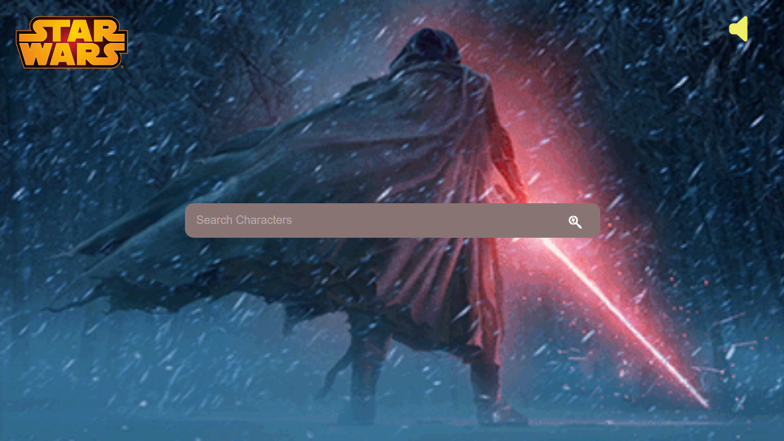
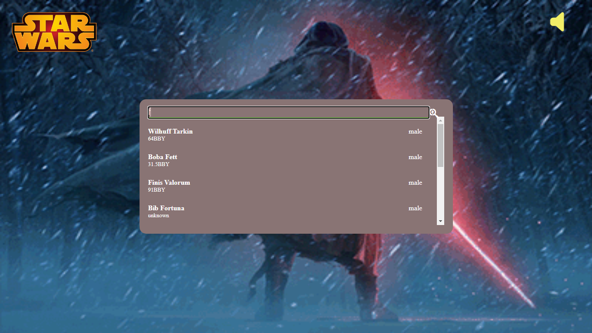
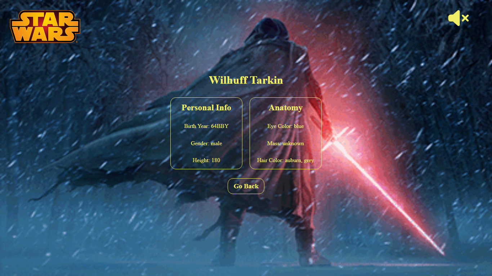

# Star War Warriors

This website is a individual assignment, This is tell about star warriors. This website is our assignment during the Masai curriculum https://incredible-crostata-a30249.netlify.app/star%20wars .

## Features

- Search Warriors Name
- Background theme instrument song

## Installation

- copy this https://github.com/sunnylalwani41/Star_War.git
- Select path where you want to store the project in your pc
- open the corresponding file / folder with editor
- open terminal of your editor
- use  --> git clone (paste link) <-- 
- after project cloned to your folder
- go to "star wars.html" inside homenavbar folder
- open with live server
    
## Tech Stack

* Javascript
* HTML
* CSS

# Screenshots
## Landing Page

## Search Functionality

## Star_War_Warrior_Details Page

